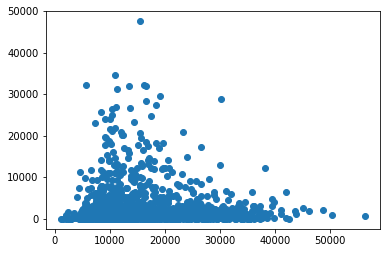
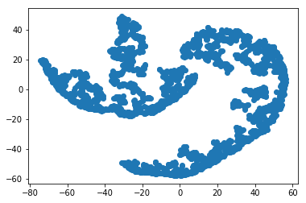

```python
d = {'T_veh':4000,'T_ped':4000,'house_val':40000,'income':40000,'age':40,'kids':4}
d['T_veh'] = 4000
d
```


    {'T_veh': 4000,
     'T_ped': 4000,
     'house_val': 40000,
     'income': 40000,
     'age': 40,
     'kids': 4}


```python
import random
for x in range(10):
  print random.randint(1,101)
```


    ---------------------------------------------------------------------------

    TypeError                                 Traceback (most recent call last)

    <ipython-input-43-123a9cc6df61> in <module>()
    ----> 1 d[0]
    

    TypeError: 'set' object does not support indexing


```python
import random
T_veh = []
T_ped = []
house_val = []
income = []
age = []
kids = []
for i in range(0,500):
    T_veh.append(random.randint(200,5000))
    T_ped.append(random.randint(100,1000))
    house_val.append(random.randint(30000,100000))
    income.append(random.randint(30000,120000))
    age.append(random.randint(16,60))
    kids.append(random.randint(0,5))
    
```


```python

```


```python

```


```python

```


```python

```


```python

```


```python
import pandas as pd 

data = pd.read_csv("Downloads\\training-data1.csv") 
data
```


<div>
<style scoped>
    .dataframe tbody tr th:only-of-type {
        vertical-align: middle;
    }

    .dataframe tbody tr th {
        vertical-align: top;
    }

    .dataframe thead th {
        text-align: right;
    }
</style>
<table border="1" class="dataframe">
  <thead>
    <tr style="text-align: right;">
      <th></th>
      <th>Intersection</th>
      <th>City</th>
      <th>Province</th>
      <th>Vehicle Traffic</th>
      <th>Pedestrian Traffic</th>
    </tr>
  </thead>
  <tbody>
    <tr>
      <th>0</th>
      <td>JARVIS ST and FRONT ST E</td>
      <td>Toronto</td>
      <td>ON</td>
      <td>15662</td>
      <td>13535</td>
    </tr>
    <tr>
      <th>1</th>
      <td>KING ST E and JARVIS ST</td>
      <td>Toronto</td>
      <td>ON</td>
      <td>12960</td>
      <td>7333</td>
    </tr>
    <tr>
      <th>2</th>
      <td>JARVIS ST and ADELAIDE ST E</td>
      <td>Toronto</td>
      <td>ON</td>
      <td>17770</td>
      <td>7083</td>
    </tr>
    <tr>
      <th>3</th>
      <td>JARVIS ST and RICHMOND ST E</td>
      <td>Toronto</td>
      <td>ON</td>
      <td>19678</td>
      <td>4369</td>
    </tr>
    <tr>
      <th>4</th>
      <td>JARVIS ST and QUEEN ST E</td>
      <td>Toronto</td>
      <td>ON</td>
      <td>14487</td>
      <td>3368</td>
    </tr>
    <tr>
      <th>5</th>
      <td>JARVIS ST and SHUTER ST</td>
      <td>Toronto</td>
      <td>ON</td>
      <td>15846</td>
      <td>3747</td>
    </tr>
    <tr>
      <th>6</th>
      <td>JARVIS ST and DUNDAS ST E</td>
      <td>Toronto</td>
      <td>ON</td>
      <td>17835</td>
      <td>5858</td>
    </tr>
    <tr>
      <th>7</th>
      <td>JARVIS ST and GERRARD ST E</td>
      <td>Toronto</td>
      <td>ON</td>
      <td>18196</td>
      <td>6493</td>
    </tr>
    <tr>
      <th>8</th>
      <td>JARVIS ST and CARLTON ST</td>
      <td>Toronto</td>
      <td>ON</td>
      <td>14222</td>
      <td>6165</td>
    </tr>
    <tr>
      <th>9</th>
      <td>JARVIS ST and WELLESLEY ST E</td>
      <td>Toronto</td>
      <td>ON</td>
      <td>18163</td>
      <td>5213</td>
    </tr>
    <tr>
      <th>10</th>
      <td>JARVIS ST and ISABELLA ST</td>
      <td>Toronto</td>
      <td>ON</td>
      <td>15197</td>
      <td>2713</td>
    </tr>
    <tr>
      <th>11</th>
      <td>MOUNT PLEASANT RD and CHARLES ST E</td>
      <td>Toronto</td>
      <td>ON</td>
      <td>16280</td>
      <td>2976</td>
    </tr>
    <tr>
      <th>12</th>
      <td>BLOOR ST E and TED ROGERS WAY</td>
      <td>Toronto</td>
      <td>ON</td>
      <td>15844</td>
      <td>9810</td>
    </tr>
    <tr>
      <th>13</th>
      <td>CHURCH ST and FRONT ST E</td>
      <td>Toronto</td>
      <td>ON</td>
      <td>10467</td>
      <td>7381</td>
    </tr>
    <tr>
      <th>14</th>
      <td>KING ST E and CHURCH ST</td>
      <td>Toronto</td>
      <td>ON</td>
      <td>12017</td>
      <td>20866</td>
    </tr>
    <tr>
      <th>15</th>
      <td>CHURCH ST and ADELAIDE ST E</td>
      <td>Toronto</td>
      <td>ON</td>
      <td>13816</td>
      <td>9692</td>
    </tr>
    <tr>
      <th>16</th>
      <td>CHURCH ST and RICHMOND ST E</td>
      <td>Toronto</td>
      <td>ON</td>
      <td>10374</td>
      <td>7179</td>
    </tr>
    <tr>
      <th>17</th>
      <td>QUEEN ST E and CHURCH ST</td>
      <td>Toronto</td>
      <td>ON</td>
      <td>13867</td>
      <td>11799</td>
    </tr>
    <tr>
      <th>18</th>
      <td>CHURCH ST and SHUTER ST</td>
      <td>Toronto</td>
      <td>ON</td>
      <td>11028</td>
      <td>6952</td>
    </tr>
    <tr>
      <th>19</th>
      <td>DUNDAS ST E and CHURCH ST</td>
      <td>Toronto</td>
      <td>ON</td>
      <td>13764</td>
      <td>10302</td>
    </tr>
    <tr>
      <th>20</th>
      <td>CHURCH ST and GERRARD ST E</td>
      <td>Toronto</td>
      <td>ON</td>
      <td>13437</td>
      <td>15840</td>
    </tr>
    <tr>
      <th>21</th>
      <td>CHURCH ST and CARLTON ST</td>
      <td>Toronto</td>
      <td>ON</td>
      <td>11648</td>
      <td>11072</td>
    </tr>
    <tr>
      <th>22</th>
      <td>CHURCH ST and WELLESLEY ST E</td>
      <td>Toronto</td>
      <td>ON</td>
      <td>12231</td>
      <td>12520</td>
    </tr>
    <tr>
      <th>23</th>
      <td>BLOOR ST E and CHURCH ST</td>
      <td>Toronto</td>
      <td>ON</td>
      <td>18339</td>
      <td>27313</td>
    </tr>
    <tr>
      <th>24</th>
      <td>ADELAIDE ST E and VICTORIA ST</td>
      <td>Toronto</td>
      <td>ON</td>
      <td>9968</td>
      <td>18326</td>
    </tr>
    <tr>
      <th>25</th>
      <td>VICTORIA ST and RICHMOND ST E</td>
      <td>Toronto</td>
      <td>ON</td>
      <td>11767</td>
      <td>10589</td>
    </tr>
    <tr>
      <th>26</th>
      <td>QUEEN ST E and VICTORIA ST</td>
      <td>Toronto</td>
      <td>ON</td>
      <td>10087</td>
      <td>24100</td>
    </tr>
    <tr>
      <th>27</th>
      <td>YONGE ST and FRONT ST</td>
      <td>Toronto</td>
      <td>ON</td>
      <td>10996</td>
      <td>10950</td>
    </tr>
    <tr>
      <th>28</th>
      <td>YONGE ST and WELLINGTON ST</td>
      <td>Toronto</td>
      <td>ON</td>
      <td>13620</td>
      <td>26656</td>
    </tr>
    <tr>
      <th>29</th>
      <td>YONGE ST and KING ST</td>
      <td>Toronto</td>
      <td>ON</td>
      <td>10911</td>
      <td>14579</td>
    </tr>
    <tr>
      <th>...</th>
      <td>...</td>
      <td>...</td>
      <td>...</td>
      <td>...</td>
      <td>...</td>
    </tr>
    <tr>
      <th>2250</th>
      <td>LUMSDEN AVE and WESTLAKE AVE</td>
      <td>Toronto</td>
      <td>ON</td>
      <td>5471</td>
      <td>498</td>
    </tr>
    <tr>
      <th>2251</th>
      <td>WELLESLEY ST E and HOMEWOOD AVE</td>
      <td>Toronto</td>
      <td>ON</td>
      <td>6199</td>
      <td>2798</td>
    </tr>
    <tr>
      <th>2252</th>
      <td>QUEENS QUAY E and LOWER SHERBOURNE ST</td>
      <td>Toronto</td>
      <td>ON</td>
      <td>6142</td>
      <td>717</td>
    </tr>
    <tr>
      <th>2253</th>
      <td>RANEE AVE and VARNA DR</td>
      <td>Toronto</td>
      <td>ON</td>
      <td>5496</td>
      <td>404</td>
    </tr>
    <tr>
      <th>2254</th>
      <td>RANEE AVE and FLEMINGTON RD</td>
      <td>Toronto</td>
      <td>ON</td>
      <td>4737</td>
      <td>265</td>
    </tr>
    <tr>
      <th>2255</th>
      <td>BATHURST ST and NIAGARA ST</td>
      <td>Toronto</td>
      <td>ON</td>
      <td>13974</td>
      <td>2290</td>
    </tr>
    <tr>
      <th>2256</th>
      <td>LAWRENCE AVE W and CORONA ST</td>
      <td>Toronto</td>
      <td>ON</td>
      <td>12634</td>
      <td>180</td>
    </tr>
    <tr>
      <th>2257</th>
      <td>DUNDAS ST W and STERLING RD</td>
      <td>Toronto</td>
      <td>ON</td>
      <td>13910</td>
      <td>955</td>
    </tr>
    <tr>
      <th>2258</th>
      <td>REXDALE BLVD and TIDEMORE AVE</td>
      <td>Toronto</td>
      <td>ON</td>
      <td>17241</td>
      <td>89</td>
    </tr>
    <tr>
      <th>2259</th>
      <td>WILSON AVE and WILLIAM CRAGG DR</td>
      <td>Toronto</td>
      <td>ON</td>
      <td>14968</td>
      <td>184</td>
    </tr>
    <tr>
      <th>2260</th>
      <td>BAY ST and CUMBERLAND ST</td>
      <td>Toronto</td>
      <td>ON</td>
      <td>11291</td>
      <td>13132</td>
    </tr>
    <tr>
      <th>2261</th>
      <td>YONGE ST and YORKVILLE AVE</td>
      <td>Toronto</td>
      <td>ON</td>
      <td>7803</td>
      <td>5014</td>
    </tr>
    <tr>
      <th>2262</th>
      <td>MARTIN GROVE RD and RAMPART RD</td>
      <td>Toronto</td>
      <td>ON</td>
      <td>9306</td>
      <td>547</td>
    </tr>
    <tr>
      <th>2263</th>
      <td>FINCH AVE W and TORRESDALE AVE</td>
      <td>Toronto</td>
      <td>ON</td>
      <td>14814</td>
      <td>298</td>
    </tr>
    <tr>
      <th>2264</th>
      <td>SCARLET RD and HILL GARDEN RD</td>
      <td>Toronto</td>
      <td>ON</td>
      <td>8437</td>
      <td>39</td>
    </tr>
    <tr>
      <th>2265</th>
      <td>KEELE ST and GRACEFIELD AVE</td>
      <td>Toronto</td>
      <td>ON</td>
      <td>18937</td>
      <td>172</td>
    </tr>
    <tr>
      <th>2266</th>
      <td>RENFORTH DR and HWY 401 WB OFF RAMP</td>
      <td>Toronto</td>
      <td>ON</td>
      <td>20163</td>
      <td>2</td>
    </tr>
    <tr>
      <th>2267</th>
      <td>QUEENS QUAY W and LOWER SPADINA AVE</td>
      <td>Toronto</td>
      <td>ON</td>
      <td>8423</td>
      <td>2887</td>
    </tr>
    <tr>
      <th>2268</th>
      <td>QUEENS QUAY W and LOWER SPADINA AVE</td>
      <td>Toronto</td>
      <td>ON</td>
      <td>7022</td>
      <td>1604</td>
    </tr>
    <tr>
      <th>2269</th>
      <td>QUEENS QUAY W and REES ST</td>
      <td>Toronto</td>
      <td>ON</td>
      <td>6665</td>
      <td>2434</td>
    </tr>
    <tr>
      <th>2270</th>
      <td>QUEENS QUAY W and LOWER SIMCOE ST</td>
      <td>Toronto</td>
      <td>ON</td>
      <td>7181</td>
      <td>2104</td>
    </tr>
    <tr>
      <th>2271</th>
      <td>QUEENS QUAY W and YORK ST</td>
      <td>Toronto</td>
      <td>ON</td>
      <td>9230</td>
      <td>4629</td>
    </tr>
    <tr>
      <th>2272</th>
      <td>QUEENS QUAY W and BAY ST</td>
      <td>Toronto</td>
      <td>ON</td>
      <td>11043</td>
      <td>12772</td>
    </tr>
    <tr>
      <th>2273</th>
      <td>QUEENS QUAY W and DAN LECKIE WAY</td>
      <td>Toronto</td>
      <td>ON</td>
      <td>5781</td>
      <td>1156</td>
    </tr>
    <tr>
      <th>2274</th>
      <td>ST DENNIS DR and DEAUVILLE LANE</td>
      <td>Toronto</td>
      <td>ON</td>
      <td>5921</td>
      <td>982</td>
    </tr>
    <tr>
      <th>2275</th>
      <td>WINDERMERE AVE and MORNINGSIDE AVE</td>
      <td>Toronto</td>
      <td>ON</td>
      <td>6488</td>
      <td>634</td>
    </tr>
    <tr>
      <th>2276</th>
      <td>GATEWAY BLVD and GRENOBLE DR</td>
      <td>Toronto</td>
      <td>ON</td>
      <td>7447</td>
      <td>1316</td>
    </tr>
    <tr>
      <th>2277</th>
      <td>ALLIANCE AVE and ROCKCLIFFE BLVD</td>
      <td>Toronto</td>
      <td>ON</td>
      <td>8780</td>
      <td>498</td>
    </tr>
    <tr>
      <th>2278</th>
      <td>OLD FINCH AVE and SEWELLS RD</td>
      <td>Toronto</td>
      <td>ON</td>
      <td>1081</td>
      <td>0</td>
    </tr>
    <tr>
      <th>2279</th>
      <td>ZOO RD and MEADOWVALE RD N ZOO W RAMP</td>
      <td>Toronto</td>
      <td>ON</td>
      <td>1982</td>
      <td>16</td>
    </tr>
  </tbody>
</table>
<p>2280 rows × 5 columns</p>
</div>


```python
data_trunc = data.loc[:,'Vehicle Traffic':'Pedestrian Traffic']
data_trunc_array=data_trunc.as_matrix()
```

    C:\Users\User\Anaconda3\lib\site-packages\ipykernel_launcher.py:2: FutureWarning: Method .as_matrix will be removed in a future version. Use .values instead.
      
    


```python
import matplotlib.pyplot as plt
plt.plot(data_trunc_array[:,0],data_trunc_array[:,1], 'o')
plt.show
```


    <function matplotlib.pyplot.show(*args, **kw)>





```python

```


```python

```


```python
from sklearn.manifold import TSNE
```


```python
data_trunc_TSNE = TSNE(n_components=2).fit_transform(data_trunc)
```


```python
data_trunc_TSNE
```


    array([[-25.396965,  39.936794],
           [-25.576214,  28.084103],
           [-19.732632,  34.68855 ],
           ...,
           [-43.04346 , -11.163238],
           [-74.314545,  19.6663  ],
           [-73.41521 ,  20.029905]], dtype=float32)


```python
import matplotlib.pyplot as plt
plt.plot(data_trunc_TSNE[:,0],data_trunc_TSNE[:,1], 'o')
plt.show
```


    <function matplotlib.pyplot.show(*args, **kw)>





```python

```
